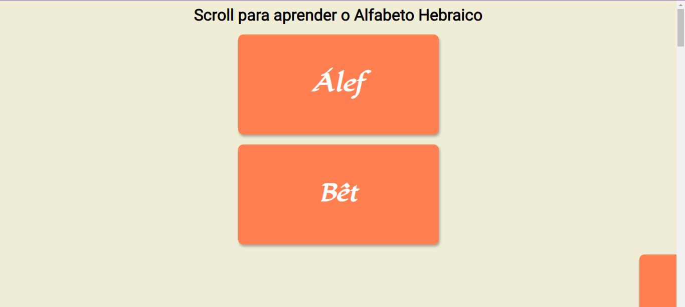
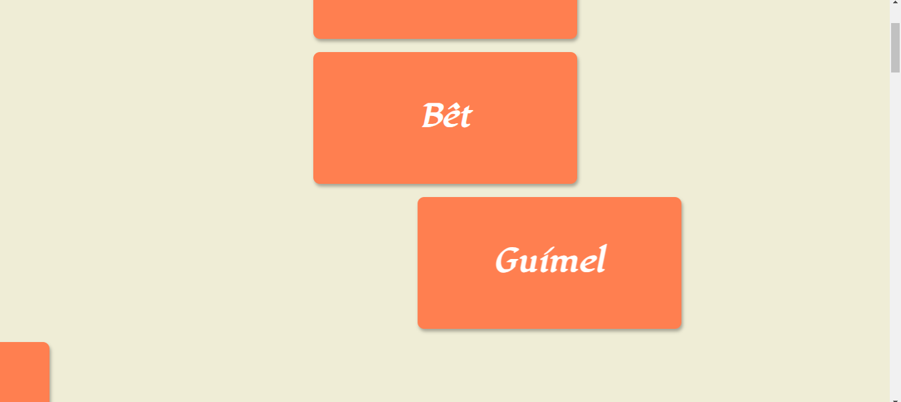
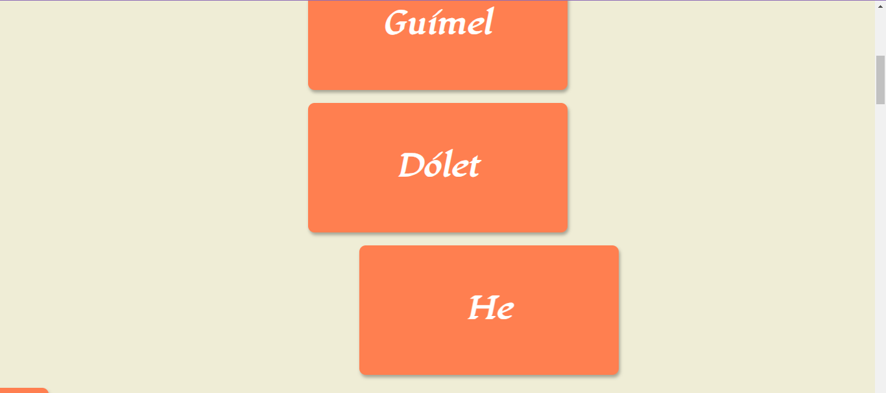

# SCROLLANDO E APRENDENDO
 Aplicação desenvolvida para fins de estudos e conhecimentos, scrollando e aprendendo é um simples projeto que apresenta divs com o alfabeto hebraico. 
 

## RESULTADO

 
## PROJETO 
O projeto Scrollando e aprendendo apresenta o alfabeto hebraico, ao "scrollar" a página ou "rolar" para baixo, com transições bem interessantes (esse código pode ser utilizado em outros projetos).
  
## TECNOLOGIAS 

 
 
 
 

